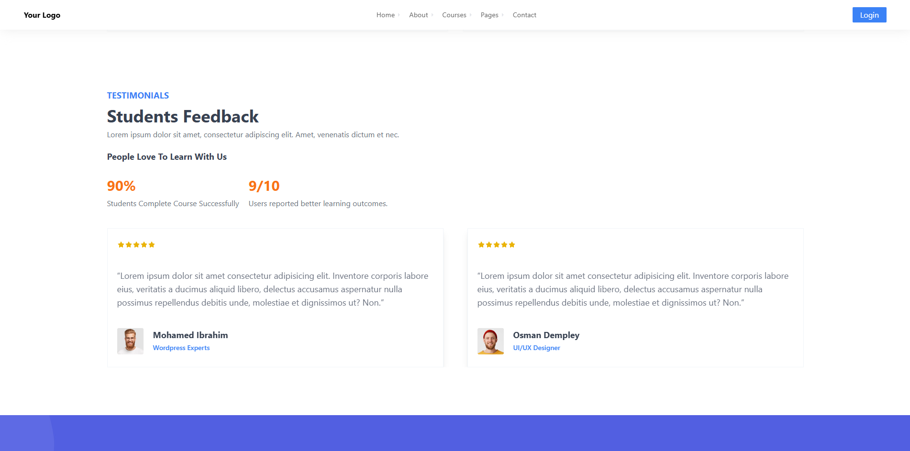

# Next-Corsera - Online Course Marketplace

Next-Corsera is a fully featured platform designed for selling and enrolling in online courses. Inspired by popular platforms like Udemy and Coursera, this project aims to provide a modern, scalable, and user-friendly system for both course creators and learners.

## Features 🌟

- **Built with Next.js** ⚡: A fast, React-based framework for server-side rendering and static site generation, ensuring optimal performance and SEO.
- **Tailwind CSS** 🎨: A utility-first CSS framework to create modern, responsive, and customizable designs quickly.
- **More than 15 Pages** 📄: Includes multiple pages such as the homepage, course listings, course detail pages, instructor dashboard, student dashboard, and more.
- **Course Listings** 📖: A visually appealing layout to showcase courses, with search and filter options for easy navigation.
- **Course Detail Page** 📖: A detailed page displaying course content, instructor information, pricing, and reviews.
- **Responsive Design** 📱💻: Fully responsive layout optimized for both mobile and desktop devices.
- **Interactive UI Components** ✨: Includes components like modals, dropdowns, tabs, and sliders for a smooth user experience.
- **Custom Animations and Transitions** 🎬: Provides smooth transitions and animations for page loads and interactions, enhancing user engagement.
- **Optimized Images and Assets** 📸: Integrated with Next.js image optimization to load images efficiently and improve page speed.

## Demo 🎥

You can explore the demo of Next-Corsera [here](https://next-corsera.vercel.app/).

## Screenshots 🖼️

Below are some screenshots of the platform:

### Homepage


### Course Detail Page


### Sections





## Technologies Used 💻🔧

- **Frontend**: 
  - [React.js](https://reactjs.org/) - For building the user interface.
  - [Next.js](https://nextjs.org/) - React framework for server-side rendering.
  - [Tailwind CSS](https://tailwindcss.com/) - For utility-first CSS styling.

## Installation ⚙️

### Steps to Install

1. **Clone the repository**:

   ```bash
   git clone https://github.com/Mo-Ibra/next-corsera
   cd next-corsera
   ```
2. **Install dependencies**:

    ```bash
    npm install
    ```

3. **Run the application:**

    ```bash
    npm run dev
    ```

4. Open your browser and go to http://localhost:3000 to view the application.

## License 🤝
This project is licensed under the MIT License - see the LICENSE file for details.

## Acknowledgments 🙏
Thanks to the creators of Next.js and Tailwind CSS, which made the development process fast and efficient. 🌟

Special thanks to all the open-source libraries and components used to build a modern and responsive user interface.
Contact 🌐

## Contact 📧

For any questions or feedback, feel free to reach out:

**Email: mohamedelgedwy245@gmail.com**

**GitHub: [@Mo-Ibra](https://github.com/Mo-Ibra)**